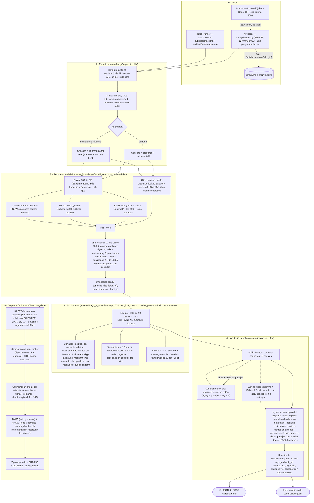

# Samu-Enjoyer · AI Week 

**¿Puede un modelo pequeño responder derecho colombiano?**

Sistema de RAG agéntico que combina un modelo de lenguaje abierto de ≤8.000
millones de parámetros con un corpus jurídico colombiano propio, para superar
el desempeño reportado por los modelos comerciales de mayor capacidad
(≈50 % de sus citas normativas son erróneas o inexistentes).

**Integrantes:** Santiago Gómez, Camilo Murcia, Angie Gutiérrez
**Repositorio:** entrega para la Hackathon 2026 (Departamento de
Ingeniería de Sistemas y Computación, Universidad de los Andes — patrocina
Software Colombia)

---

## Contenido

1. [El reto](#el-reto)
2. [Restricciones de cómputo](#restricciones-de-cómputo)
3. [Arquitectura del sistema](#arquitectura-del-sistema)
4. [Decisiones de arquitectura](#decisiones-de-arquitectura)
5. [Pipeline y pasos obligatorios](#pipeline-y-pasos-obligatorios)
6. [Estructura del repositorio](#estructura-del-repositorio)
7. [Formato de entrega](#formato-de-entrega)
8. [Calificación](#calificación)
9. [Cronograma y entregables](#cronograma-y-entregables)
10. [Corpus e índice](#corpus-e-índice)
11. [Reproducción](#reproducción)
12. [Resultados sobre las preguntas de muestra](#resultados-sobre-las-preguntas-de-muestra)
13. [Interfaz gráfica](#interfaz-gráfica)
14. [Verificación en vivo](#verificación-en-vivo)
15. [Limitaciones conocidas](#limitaciones-conocidas)
16. [Checklist antes de la entrega](#checklist-antes-de-la-entrega)

---

## El reto

En 2026 se publicó el primer *benchmark* de fiabilidad de modelos de lenguaje
sobre derecho colombiano (1.042 preguntas verificadas por juristas, en diez
áreas del ordenamiento). Los quince modelos evaluados, incluidos los de mayor
capacidad del mercado, muestran limitaciones sustantivas:

| Resultado | Valor |
|---|---|
| Mejor exactitud en preguntas cerradas | 0,905 (Gemini 3.1 Pro) |
| Mejor corrección en texto libre (RAGAS) | 0,451 (GPT-5.4) |
| Normas citadas erróneas o inexistentes | ≈ la mitad |
| Correlación pertinencia aparente ↔ corrección | ρ = −0,46 |

Todos respondieron **sin acceso a fuentes externas**. La hipótesis de trabajo
del reto: el corpus determina el desempeño más que el modelo. El valor del
ejercicio está en la construcción del corpus y en que cada cita sea
verificable contra evidencia efectivamente recuperada.

El banco cubre diez áreas del derecho colombiano (constitucional,
administrativo, penal, procesal, comercial y sociedades, civil, familia,
tributario, laboral, mercados) en tres formatos — cerradas, semiabiertas y
abiertas — y tres niveles de complejidad. **No** incluye derecho ambiental ni
derecho internacional.

## Restricciones de cómputo

| Requisito | Detalle |
|---|---|
| Decoder | Abierto, ≤ 8.000 M de parámetros (p. ej. `Qwen/Qwen3-8B`, `Llama-3.1-8B-Instruct`, `salamandra-7b-instruct`). Se admite cuantización 4/8 bits. |
| Encoder | Abierto (p. ej. `BAAI/bge-m3`, `multilingual-e5-large`, `jina-embeddings-v3`). |
| Temperatura | 0 en la ejecución final — el sistema debe ser determinista. |

**Causales de descalificación:** uso de un modelo cerrado en cualquier
componente (generación, reescritura, reordenamiento o datos sintéticos),
edición manual de respuestas, contaminación del índice con el banco de
preguntas, o divergencia en la verificación en vivo del sábado.

## Arquitectura del sistema

Un solo agente atiende dos entradas: el lote de preguntas (`batch_runner` →
`submissions.jsonl`) y la interfaz gráfica (React → API local FastAPI). Las
dos usan el mismo agente, con la misma configuración, y sacan la respuesta de
`LegalAgent.to_submission`. Por pregunta: flags → consulta determinista →
recuperación híbrida con reranker → escritura con Qwen3-8B → validación
determinista de fuentes → post-procesado determinista → registro del esquema
oficial. Un solo ciclo: el juez y su segundo ciclo existen en el código, pero
la entrega no los usa (ver [LLM as judge](#llm-as-judge)).



El corpus y el índice (sección 5) se construyen offline y alimentan la
recuperación (sección 2) y el visor de documentos de la interfaz.

### Cambios frente a la arquitectura inicial

| Pieza | Diseño inicial | Arquitectura actual (entrega) | Por qué |
|---|---|---|---|
| Interfaz | Por definir (`interfaz/`) | `frontend/` (Vite + React) + API local `src/api/server.py` | Misma ruta de código que el lote: lo que muestra la UI es lo que se entregaría |
| Reescritura de consulta | LLM propone términos y normas candidatas | La pregunta tal cual (+ opciones en cerradas) y siglas expandidas por diccionario | El LLM inventaba normas: recall_docs 0,881 → 0,798; además los pasajes dependerían del LLM en la verificación en vivo |
| BM25 | En todos los formatos | Solo en cerradas; texto libre solo con HNSW (+ lista de normas) | En lenguaje natural BM25 trae pasajes que comparten palabras pero no tema |
| Recuperación, ajustes | RRF + reranker | + siglas, decreto del SMLMV con montos en pesos, filtro de casi duplicados, 1.º de BM25 de normas asegurado en cerradas | recall_docs@10 0,809 → 0,858 |
| Juez y ciclos | Gemma 4 E4B, hasta 2 ciclos | Apagado (`--juez` lo enciende) | Sin juez: RAGAS 0,485 contra 0,469, cerradas 13/15 contra 12/15 y la mitad del tiempo |
| Cerradas | Letra y justificación en una llamada | Justificación primero, letra elegida en una 2.ª llamada y anclada al respaldo léxico; respaldo determinista si no hay letra; nunca se abstienen | La letra no salía del propio razonamiento; abstenerse vale menos que responder |
| Abiertas | Campos libres | IRAC dentro de los 4 campos del esquema | Requisito de los organizadores (2/oct) |
| Salida | Borrador del LLM | Post-procesado determinista (`src/agent/citas.py`): citas legibles, fuentes de los pasajes, poda, topes de palabras | El evaluador no reconoce `[doc_id/art_N]`; citación 16,73 → 18,37 sin citas sin respaldo |
| Determinismo | T=0 | + `cache_prompt: false` y `-np 1` | Con la caché de prompts dos corridas daban 0/50 respuestas idénticas |
| Índice | Reconstrucción completa | Alta incremental (`agregar_chunks`): 9 fuentes del 3/oct sin recalcular lo existente | Documentos citados por el test que no estaban en el corpus |

**Costo por pregunta (configuración de la entrega):** 1 llamada de escritura
(+1 de elección de letra en cerradas). Validación, flags, fusión y búsqueda de
citas no usan el LLM. ~1 s de recuperación y ~6-7 s por pregunta en la RTX
4090 (8,9 s en la A40); el LLM corre en llama.cpp con peticiones secuenciales.

**Por qué también recuperan las preguntas cerradas.** Sin pasajes
recuperados, cualquier norma citada en `justificacion` vale como máximo 0,5
en el componente de citación, y si no coincide con el fundamento de
referencia se penaliza el doble — recuperar también descarta activamente las
opciones B, C y D.

**Por qué no hay memoria entre preguntas.** El jurado regenera preguntas
sueltas en la verificación en vivo; una respuesta que dependiera de turnos
anteriores no sería reproducible, lo que es causal de descalificación. La
interfaz guarda el historial de chats solo en el navegador y manda cada
pregunta sola al back.

## Decisiones de arquitectura

| Componente | Elección | Motivo |
|---|---|---|
| Decoder | `Qwen/Qwen3-8B` GGUF Q4_K_M en llama.cpp (T=0, top_k=1, semilla fija, contexto 32k, `cache_prompt: false`, `-np 1`, sin modo de razonamiento) | Modelo abierto ≤ 8B; con la caché de prompts la salida dependía de la pregunta anterior. El modo de razonamiento bajó RAGAS (0,441 contra 0,470) y duplicó el tiempo |
| Encoder | `Qwen/Qwen3-Embedding-0.6B` (dim 1024) | Ganador del banco de pruebas: mejor recall de documentos y mejor orden que `bge-m3` y `e5-large-instruct` |
| Léxico | BM25 (`bm25s`) con raíces Snowball, sin quitar stopwords, ids normativos y sentencias en un token | El vector de "artículo 42" y "artículo 24" es casi idéntico; BM25 resuelve identificadores numéricos. Sin raíces rinde menos |
| Recuperación | Híbrida: siglas expandidas + citas expresas de la pregunta + BM25 (100, solo cerradas) + HNSW (100) + lista de normas (BM25 y HNSW solo sobre normas, 50 + 50), fusión RRF k=60 | La lista de normas evita que las sentencias (~86 % de los chunks) entierren códigos y Constitución; en texto libre BM25 trae pasajes de otro tema |
| Reranker | `BAAI/bge-reranker-v2-m3` (fp16) sobre los 150 primeros de la fusión | `Qwen3-Reranker-0.6B` fue peor y 4,5× más lento |
| Selección final | Castigo por tipo (preámbulo, notas, ventana de sentencia, anexo) y por vigencia (derogada 0,15), +0,1 a normas de prioridad alta, máximo 4 sentencias y 3 pasajes por documento, sin casi duplicados (≥ 70 % de texto repetido) → 10 pasajes | recall_docs@10 0,439 → 0,858; el evaluador solo cuenta los 10 primeros pasajes |
| Segmentación | Un chunk por artículo (partes reunidas al entregar); sentencias en ficha + ventanas de ~1.700 caracteres por sección | Exigido por el paso 1 y el anexo B.2 del enunciado |
| Índice vectorial | FAISS `IndexHNSWSQ` 8 bits (M=32, efConstruction=200, efSearch=256) | 2.211.359 chunks (2.210.629 + 730 de las 9 fuentes del 3/oct, agregados con `agregar_chunks` sin recalcular lo existente): un índice exacto no cabe en el portátil |
| Orquestación | LangGraph (`StateGraph` en `src/agent/graph.py`), sin checkpointer ni ramas paralelas | Sin memoria entre preguntas: cada respuesta se reproduce sola |
| Post-procesado | Determinista (`src/agent/citas.py`, `src/agent/salida.py`): tipos del esquema, citas `[doc_id/art_N]` → "artículo N del …", normas y sentencias de los pasajes consultados, poda de oraciones accesorias, topes de palabras | El evaluador no reconoce los IDs canónicos; citación 16,73 → 18,37 sin citas sin respaldo |
| Interfaz | `frontend/` (Vite + React) contra la API local `src/api/server.py` (FastAPI) | El back arma el agente igual que `batch_runner` y responde con `to_submission`: la UI muestra lo mismo que se entrega |
| Validación de citas | Determinista: ID canónico `<doc_id>/art_<N>` contra los 10 `pasajes_recuperados`; la cita ausente se suprime | El evaluador no mira el corpus, mira esos 10 pasajes |
| Juez (opcional, `--juez`, **apagado en la entrega**) | Gemma 4 E4B en Ollama, servidor distinto del escritor; en cerradas vota a ciegas | Con la URL del escritor juzgaría el mismo Qwen (llama.cpp ignora el campo `model`) |
| Abstención | Solo en texto libre: `abstencion: true` cuando ninguna cita queda respaldada, o cuando el LLM no responde; las cerradas siempre llevan letra (regla de los organizadores) (con `--juez`, también si el juez declara que los pasajes no bastan) | Vale más que citar sin respaldo (sección 6.1 del enunciado) |
| Ciclos del juez (solo con `--juez`) | Máximo 2 | Presupuesto de tiempo: 992 preguntas / 6 horas |

### Recuperación sobre las 50 preguntas de muestra (corpus completo)

| Métrica @10 | Sin ajustes | Configuración final |
|---|---|---|
| recall_citas | 0,862 | **0,931** |
| recall_docs | 0,439 | **0,858** |
| MRR | 0,236 | **0,423** |
| nDCG | 0,314 | **0,577** |

Por formato (recall_citas / recall_docs): cerradas 0,962 / 0,808, semiabiertas
0,986 / 0,944, abiertas 0,5 / 0,5 (5 preguntas). Comparaciones completas en
`evaluation/retrieval_benchmark/results/` (`comparacion_banco_normas_fichas.md`
para la selección de modelos y `comparacion.md` para el corpus completo).

## Pipeline y pasos obligatorios

| Paso | Qué exige el enunciado | Requisito mínimo |
|---|---|---|
| 1. Ingesta y normalización | Descargar y limpiar las fuentes; metadatos: tipo de norma, número, año, artículo, órgano emisor, vigencia | Cada fragmento debe permitir identificar norma y artículo |
| 2. Indexación vectorial | Encoder abierto | Índice reconstruible mediante script |
| 3. Generación con el LLM | Objeto JSON con las claves fijas de cada formato (ver [Formato de entrega](#formato-de-entrega)) | Claves obligatorias, no admiten modificación |
| 4. Citas y abstención | Toda norma citada debe venir de un pasaje efectivamente recuperado | `abstencion: true` si el corpus no da fundamento suficiente |
| 5. Enriquecimiento del corpus | Identificar y sumar fuentes según la composición del banco y los `legal_basis` de la muestra | `CORPUS.md` (inventario, criterio, método) + `corpus_manifest.json` |

Fuentes admitidas: SUIN-Juriscol, Secretaría del Senado, relatorías de la
Corte Constitucional / Corte Suprema de Justicia / Consejo de Estado, DIAN,
SIC, Diario Oficial.

## Estructura del repositorio

```
Samu-Enjoyer/
├── README.md                  # este archivo
├── LICENSE
├── requirements.txt
├── submissions.jsonl          # 992 respuestas, esquema oficial
├── CORPUS.md                  # bitácora del corpus
├── corpus_manifest.json       # inventario de documentos del corpus
├── informe/
│   ├── main.tex               # fuente del informe técnico
│   └── INFORME_TECNICO.pdf    # máximo 3 páginas
├── frontend/                  # interfaz gráfica (Vite + React + TypeScript)
├── src/                       # pipeline reproducible
│   ├── ingest/                 # paso 1 — ingesta y conversión a Markdown
│   ├── knowledge/              # paso 2 — chunking, BM25, HNSW, búsqueda híbrida, reranker, agregar_chunks
│   ├── agent/                  # paso 3-4 — grafo LangGraph, escritura, validación, post-procesado, juez (apagado)
│   └── api/                    # back local de la interfaz (FastAPI)
├── evaluation/
│   └── retrieval_benchmark/    # banco de pruebas de recuperación y sus resultados
└── scripts/                    # material oficial del reto (evaluate.py, citations.py)
```

El corpus procesado, el índice vectorial y el video **no se versionan** en
este repositorio por su tamaño; se depositan en la nube y se enlazan en
[Corpus e índice](#corpus-e-índice).

## Formato de entrega

Un objeto JSON por línea en `submissions.jsonl`, validado contra
[`schema/submission.schema.json`](https://github.com) del material del reto.
Campos comunes: `id`, `formato`, `abstencion`, `pasajes_recuperados`.

| Formato | Claves obligatorias adicionales |
|---|---|
| `multiple_choice` (cerradas) | `respuesta_correcta` (letra), `justificacion`, `descarte_opciones` |
| `semi_open` (semiabiertas) | `respuesta` (3–5 oraciones, máx. 150 palabras), `palabras_clave`, `referencia_legal` |
| `open_ended` (abiertas) | `marco_normativo`, `analisis` (5–8 oraciones), `jurisprudencia`, `conclusion` |

Cada elemento de `pasajes_recuperados` requiere `doc_id` y `texto`; `inicio`,
`fin` y `score` son opcionales. Las claves del JSON son fijas — el evaluador
opera sobre ellas; el contenido y el prompt que lo produce son libres.

## Calificación

**Total: 100 puntos.**

| Componente automático (80 pts, conjunto ciego) | Puntos | Referencia a superar |
|---|---:|---|
| Exactitud en cerradas (289 ítems) | 20 | 0,905 |
| Corrección en texto libre (RAGAS, 250 ítems, juez `glm-5.3-flash`) | 30 | 0,451 |
| Calidad de citación (recall ponderado − 2× tasa sin respaldo) | 20 | — |
| Abstención calibrada (correcta=1, abstención=0,5, errónea=0) | 10 | — |

| Componente de interfaz, corpus e ingeniería (20 pts) | Puntos |
|---|---:|
| Interfaz gráfica (consulta E2E 4, evidencia visible 3, identidad Software Colombia 3) | 10 |
| Bitácora y corpus publicado | 5 |
| Video ≤ 5 min (único evaluado por jurados humanos) | 3 |
| Reproducibilidad (un único comando, contenedor limpio) | 2 |

Clasificación de cada cita: coincide con la referencia **y** está respaldada
→ 1,0; coincide pero sin respaldo → 0,5; no coincide pero está respaldada →
0 (sin penalización); no coincide y sin respaldo → penalización del doble de
un acierto. La abstención sistemática produce solo 5 puntos — no es
estrategia competitiva.

## Cronograma y entregables

```
Lunes           Sesión inaugural: material completo, 50 preguntas de muestra
Martes-viernes  Trabajo remoto: corpus + autoevaluación con evaluate.py
Viernes 13-17h  Charlas AI Week (asistencia obligatoria)
Viernes 17:00   Reporte de avance (1 página, PDF) -> rf.manrique@uniandes.edu.co
Sábado  09:00   Entrega presencial de las 992 preguntas restantes
Sábado 09-15h   Ejecución ciega + interfaz gráfica
Sábado  15:00   Cierre de entregas (repositorio + enlace al corpus/índice)
Sábado 15-17h   Verificación en vivo
Sábado 18-19h   Resultados y premiación
```

| N.º | Entregable | Ubicación |
|---|---|---|
| 1 | Reporte de avance de una página | Correo (viernes) |
| 2 | Repositorio con README (dependencias, arquitectura, comando único) | Este repositorio |
| 3 | `submissions.jsonl` (992 respuestas) | Este repositorio |
| 4 | `CORPUS.md` + `corpus_manifest.json` | Este repositorio |
| 5 | Corpus enriquecido + índice vectorial, licencia abierta | Nube (enlazado abajo) |
| 6 | Informe técnico (≤ 3 páginas) | Este repositorio |
| 7 | Video (≤ 5 min) | Repositorio o nube |
| 8 | Interfaz gráfica funcional | Este repositorio |

## Corpus e índice

<!-- OBLIGATORIO. El jurado descarga desde aquí. Verificar el enlace desde una
     sesión privada del navegador antes de las 15:00 del sábado. -->

| Recurso | Enlace | Tamaño | Licencia |
|---|---|---|---|
| Corpus procesado e índice vectorial | `<URL>` | | |

El comprimido se descomprime en la raíz del repositorio y deja todo bajo
`corpus/`: `LICENSE` (CC BY 4.0), `LEEME.md`, `SHA256SUMS.txt`,
`corpus_manifest.json`, `chunks/chunks.sqlite` (corpus enriquecido:
2.210.629 pasajes con `doc_id` y metadatos) e `indices/` (`bm25_todo`,
`bm25_normas`, `qwen3-emb-0.6b_todo` y `qwen3-emb-0.6b_normas`, cada índice
denso con `hnsw.faiss` + `ids.json` + `info.json`). Pesa ~15 GB
descomprimido. `python -m src.knowledge.verify_indices` debe terminar en
`TODO CORRECTO`. El enlace permanece activo hasta
`<fecha, treinta días después del evento>`.

Corpus: 31.157 documentos objetivo, 31.037 procesados (99,6 %), 24,86 GB de
originales; 117 fallas permanentes en la fuente oficial (detalle en
`DESCARGA.md`).

## Reproducción

<!-- PENDIENTE: envolver estos pasos en un único comando (run.sh); hoy no existe. -->

```bash
# 1. Dependencias (Python 3.12; en GPU, primero torch con CUDA)
pip install torch --index-url https://download.pytorch.org/whl/cu124
pip install -r requirements.txt -r requirements-rag.txt -r requirements-agent.txt

# 2. Índice: descomprimir el zip de "Corpus e índice" en la raíz del repo
python -m src.knowledge.verify_indices            # debe terminar en TODO CORRECTO

# 3. Configuración por máquina
cp .env.example .env                              # RAG_DEVICE_DENSO=cpu en GPUs de <= 8 GB

# 4. Modelo local: escritor (llama.cpp). El juez (Ollama, `ollama pull gemma4:e4b`) solo con --juez
llama-server -m Qwen3-8B-Q4_K_M.gguf --host 127.0.0.1 --port 8010 -c 32768 -np 1 --jinja --temp 0 --top-k 1 --seed 42 -ngl 99

# 5. Generar y evaluar
python -m src.agent.batch_runner --salida submissions.jsonl
python scripts/evaluate.py --submission entregables/submissions.jsonl --split sample
```

`LLM_BASE_URL` en `.env` debe apuntar al puerto de `llama-server`. Prueba de
humo sin índices ni LLM: `python -m src.agent.batch_runner --mock --limite 3`.

**Requisitos de hardware:** corrida oficial y verificación en vivo en una Dell Precision 3680 con RTX 4090 de 24 GB, 64 GB de RAM y Ubuntu 22.04 (un solo proceso, `-np 1`; ~13-14 GB de GPU). Las mediciones de la muestra se hicieron en una A40 (48 GB). En un
portátil con GPU de 4 GB la recuperación corre con el embedder en CPU y el
reranker en GPU (6,4 s por pregunta, mismos pasajes que la A40) y el LLM en CPU.
**Tiempo en la A40 sobre las 50 de muestra:** ~8,9 s por pregunta (~7 min); en la 4090 se estiman ~6-7 s.

### Subagente de búsqueda de citas

Antes del juez, `src/agent/tools/citation_search_tool.py` (nodo `buscar_citas` del
grafo, determinista y sin LLM) **suprime del borrador** cada cita que no está entre los
pasajes recuperados: toda respuesta se redacta solo con los 10 pasajes de la búsqueda.

Con `CITAS_AGREGAR_PASAJES=1` (apagado por defecto) busca además la cita en
`corpus/chunks/chunks.sqlite` y, si existe y está vigente, agrega su pasaje (sustituye al
último pasaje no citado, nunca más de 10). Está apagado porque la afirmación no se
redactó con ese texto y porque los pasajes dejarían de depender solo de la búsqueda
determinista, que es lo que se reproduce en la verificación en vivo.

### LLM as judge

El juez (`src/agent/tools/judge_tool.py`) revisa (solo con `--juez`; **descartado para la entrega**: RAGAS 0,485 sin juez contra 0,469 con juez, 13/15 contra 12/15 en cerradas) cada borrador contra los 10
pasajes y el grafo de LangGraph (`src/agent/graph.py`) reintenta una vez, con la
consulta ajustada por su feedback, si lo rechaza. Es opcional y se activa con `--juez`:

```bash
python -m src.agent.batch_runner --juez        # traza del juez en <salida>.juez.jsonl
python -m src.agent.judge_eval --juez gemma4:e4b@http://localhost:11434/v1 \
                               --juez Qwen/Qwen3-8B@http://localhost:8000/v1
```

`judge_eval` corre varios modelos como juez sobre los mismos borradores y mide,
en las cerradas, cuánto coincide su veredicto con el acierto real: sirve para
decidir qué modelo escribe y cuál juzga.

| Variable | Default | Uso |
|---|---|---|
| `LLM_BASE_URL` / `LLM_MODEL` | `http://localhost:8000/v1` / `Qwen/Qwen3-8B` | Escritor |
| `JUDGE_BASE_URL` / `JUDGE_MODEL` | `http://localhost:11434/v1` / `gemma4:e4b` | Juez (modelo y servidor distintos del escritor) |
| `JUDGE_TIMEOUT` / `JUDGE_MAX_TOKENS` | `60` / `1024` | Límites de la llamada del juez |
| `JUDGE_THINKING` | `0` | `1` activa el razonamiento del modelo |
| `JUDGE_VOTO_CERRADAS` | `1` | En las cerradas el juez vota a ciegas (sin ver el borrador) y se compara su letra con la del escritor; `0` vuelve a la revisión del borrador |
| `JUDGE_ABSTENER` | `1` | `0` desactiva la abstención cuando el juez declara que los pasajes no bastan |

El borrador se aprueba si responde la sub-tarea, no tiene afirmaciones sin
soporte y no cita IDs ajenos a los pasajes; esa decisión se toma en código a
partir de lo que reporta el modelo. Si el juez no responde o devuelve algo que
no es el JSON esperado, el borrador se conserva sin reintento.

## Resultados sobre las preguntas de muestra

| Componente | Puntos obtenidos | Posibles |
|---|---:|---:|
| Exactitud en cerradas | | 20 |
| Corrección en texto libre (RAGAS) | | 30 |
| Calidad de citación | | 20 |
| Abstención calibrada | | 10 |

## Interfaz gráfica

Permite formular una pregunta jurídica y ver la respuesta junto con los
pasajes recuperados y las normas citadas: las citas del borrador se numeran y
abren su pasaje, y cada pasaje abre el documento completo del corpus con el
fragmento resaltado. Front en `frontend/` (detalles y contrato en
`frontend/README.md`); back en `src/api/server.py`.

```bash
# 1. LLM en el puerto 8010 (el 8000 es del back)
llama-server -m Qwen3-8B-Q4_K_M.gguf --host 127.0.0.1 --port 8010 -c 32768 -np 1 --jinja --temp 0 --top-k 1 --seed 42 -ngl 99
# 2. Back: carga índices, reranker y embedder (~1-2 min) y escucha en 127.0.0.1:8000
pip install -r requirements-api.txt
LLM_BASE_URL=http://127.0.0.1:8010/v1 python -m src.api.server     # --mock: sin índices ni LLM
# 3. Front (Node 18+): VITE_USE_MOCK=0 en frontend/.env
cd frontend && cp .env.example .env && npm install && npm run dev   # http://localhost:3000
```

| Endpoint | Qué hace |
|---|---|
| `GET /api/salud` | Modo (`real`/`mock`), URL del LLM, si hay `chunks.sqlite` y si hay una pregunta en curso |
| `POST /api/preguntar` | `{"pregunta": "…"}` (opcionales: `id`, `formato`, `opciones`, flags) → registro de `submissions.jsonl` + `chunk_id`, encabezado y vigencia de cada pasaje, `opciones`, `borrador` con IDs canónicos y `latencia_ms`. Separa las opciones `A) … D)` escritas en el texto |
| `GET /api/documentos/{doc_id}` | Front-matter y Markdown de `corpus/md/<doc_id>.md` o, si no está, el documento armado con sus chunks |

El back atiende una pregunta a la vez (como `batch_runner`, con `-np 1`).
Un item del banco enviado con su `id`, `formato` y `opciones` pasa por el
mismo código que su línea de `submissions.jsonl` (la verificación en vivo
oficial se hace igual con `batch_runner`, sección 00 de `CLAUDE.md`).

## Verificación en vivo

El sábado (15:00–17:00) el jurado regenera 2–3 preguntas ya entregadas con
temperatura 0; deben coincidir las normas citadas y los `pasajes_recuperados`
con lo presentado. El índice queda congelado en el momento de la entrega y
no se modifica después.

## Limitaciones conocidas

1. **Preguntas abiertas:** son casos que no nombran la norma; el recall de la
   recuperación cae a 0,5 / 0,5 (5 preguntas en la muestra). La reescritura de
   la consulta con el LLM se probó y se descartó (inventaba normas).
2. **Dispersión jurisprudencial:** las ventanas de sentencias son ~86 % de los
   chunks y muchas repiten el mismo párrafo. Se contiene con la lista de normas,
   el tope de 4 sentencias y el filtro de casi duplicados, que son reglas fijas.
3. **Ajuste sobre 50 preguntas:** castigos, topes y umbrales se eligieron con la
   misma muestra con que se reportan.
4. **Datos anuales** (salario mínimo, UVT) no siempre llegan a los 10 pasajes.
5. **Fuentes:** 117 documentos no se pudieron descargar (URLs que redirigen a
   una página de filtro o que el servidor entrega vacías) y los formatos de
   origen son heterogéneos (HTML, PDF, DOC), con OCR en parte de los PDF.
6. **Determinismo del decoder:** los pasajes son idénticos entre máquinas; el
   texto generado en GPU y en CPU puede diferir aun con temperatura 0.

## Checklist antes de la entrega

- [ ] `submissions.jsonl` valida contra `schema/submission.schema.json`.
- [ ] `python scripts/evaluate.py --submission submissions.jsonl --split sample` corre sin errores.
- [ ] El índice quedó congelado y no se modifica después de la entrega.
- [ ] La temperatura del decoder está en 0.
- [ ] Este `README` tiene la sección `## Corpus e índice` con el enlace activo.
- [ ] El enlace abre desde una sesión privada del navegador, sin pedir permisos.
- [ ] El comprimido del corpus/índice incluye `LICENSE`.
- [ ] La interfaz gráfica corre en el equipo del grupo.
- [ ] El repositorio es accesible para el jurado.

---