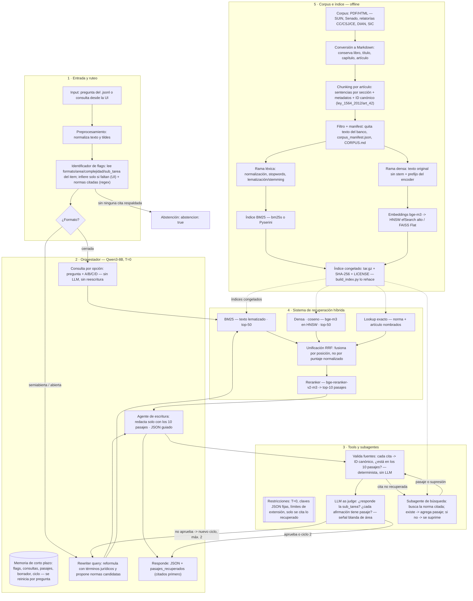

# Samu-Enjoyer · AI Week 

**¿Puede un modelo pequeño responder derecho colombiano?**

Sistema de RAG agéntico que combina un modelo de lenguaje abierto de ≤8.000
millones de parámetros con un corpus jurídico colombiano propio, para superar
el desempeño reportado por los modelos comerciales de mayor capacidad
(≈50 % de sus citas normativas son erróneas o inexistentes).

**Integrantes:** Santiago Gómez, Camilo Murcia, Angie Gutiérrez
**Repositorio:** entrega para la Hackathon 2026 (Departamento de
Ingeniería de Sistemas y Computación, Universidad de los Andes — patrocina
Software Colombia)

---

## Contenido

1. [El reto](#el-reto)
2. [Restricciones de cómputo](#restricciones-de-cómputo)
3. [Arquitectura del sistema](#arquitectura-del-sistema)
4. [Decisiones de arquitectura](#decisiones-de-arquitectura)
5. [Pipeline y pasos obligatorios](#pipeline-y-pasos-obligatorios)
6. [Estructura del repositorio](#estructura-del-repositorio)
7. [Formato de entrega](#formato-de-entrega)
8. [Calificación](#calificación)
9. [Cronograma y entregables](#cronograma-y-entregables)
10. [Corpus e índice](#corpus-e-índice)
11. [Reproducción](#reproducción)
12. [Resultados sobre las preguntas de muestra](#resultados-sobre-las-preguntas-de-muestra)
13. [Interfaz gráfica](#interfaz-gráfica)
14. [Verificación en vivo](#verificación-en-vivo)
15. [Limitaciones conocidas](#limitaciones-conocidas)
16. [Checklist antes de la entrega](#checklist-antes-de-la-entrega)

---

## El reto

En 2026 se publicó el primer *benchmark* de fiabilidad de modelos de lenguaje
sobre derecho colombiano (1.042 preguntas verificadas por juristas, en diez
áreas del ordenamiento). Los quince modelos evaluados, incluidos los de mayor
capacidad del mercado, muestran limitaciones sustantivas:

| Resultado | Valor |
|---|---|
| Mejor exactitud en preguntas cerradas | 0,905 (Gemini 3.1 Pro) |
| Mejor corrección en texto libre (RAGAS) | 0,451 (GPT-5.4) |
| Normas citadas erróneas o inexistentes | ≈ la mitad |
| Correlación pertinencia aparente ↔ corrección | ρ = −0,46 |

Todos respondieron **sin acceso a fuentes externas**. La hipótesis de trabajo
del reto: el corpus determina el desempeño más que el modelo. El valor del
ejercicio está en la construcción del corpus y en que cada cita sea
verificable contra evidencia efectivamente recuperada.

El banco cubre diez áreas del derecho colombiano (constitucional,
administrativo, penal, procesal, comercial y sociedades, civil, familia,
tributario, laboral, mercados) en tres formatos — cerradas, semiabiertas y
abiertas — y tres niveles de complejidad. **No** incluye derecho ambiental ni
derecho internacional.

## Restricciones de cómputo

| Requisito | Detalle |
|---|---|
| Decoder | Abierto, ≤ 8.000 M de parámetros (p. ej. `Qwen/Qwen3-8B`, `Llama-3.1-8B-Instruct`, `salamandra-7b-instruct`). Se admite cuantización 4/8 bits. |
| Encoder | Abierto (p. ej. `BAAI/bge-m3`, `multilingual-e5-large`, `jina-embeddings-v3`). |
| Temperatura | 0 en la ejecución final — el sistema debe ser determinista. |

**Causales de descalificación:** uso de un modelo cerrado en cualquier
componente (generación, reescritura, reordenamiento o datos sintéticos),
edición manual de respuestas, contaminación del índice con el banco de
preguntas, o divergencia en la verificación en vivo del sábado.

## Arquitectura del sistema

Flujo agéntico con máximo **dos ciclos** por pregunta: entrada y ruteo →
orquestador → recuperación híbrida con reranker → escritura → validación
determinista de fuentes → juez → reintento si no aprueba.



**Costo por pregunta:** cerradas 2 llamadas (escritura + juez); semiabiertas
y abiertas 3 (rewriter + escritura + juez); +3 si el juez rechaza el primer
ciclo. Validación, flags, fusión RRF y búsqueda de citas son deterministas y
no usan el LLM — presupuesto de referencia: ~22 s/pregunta sobre 992
preguntas en 6 horas, con *vLLM* sirviendo varias en paralelo.

**Por qué también recuperan las preguntas cerradas.** Sin pasajes
recuperados, cualquier norma citada en `justificacion` vale como máximo 0,5
en el componente de citación, y si no coincide con el fundamento de
referencia se penaliza el doble — recuperar también descarta activamente las
opciones B, C y D.

**Por qué no hay memoria entre preguntas.** El jurado regenera preguntas
sueltas en la verificación en vivo; una respuesta que dependiera de turnos
anteriores no sería reproducible, lo que es causal de descalificación. La
memoria de conversación, si se implementa, vive solo en la interfaz.

## Decisiones de arquitectura

| Componente | Elección | Motivo |
|---|---|---|
| Decoder | `Qwen/Qwen3-8B` (T=0) | Modelo abierto ≤ 8B usado también como juez |
| Encoder | `BAAI/bge-m3` | Multilingüe, admite recuperación densa + prefijos |
| Reranker | `BAAI/bge-reranker-v2-m3` | Reordena el top-100 fusionado a top-10 |
| Recuperación | Híbrida: BM25 + densa (coseno) + lookup exacto por ID canónico, fusión RRF | El vector de "artículo 42" y "artículo 24" es casi idéntico; BM25 y el lookup exacto resuelven identificadores numéricos |
| Segmentación | Un chunk por artículo; sentencias por sección | Exigido por el paso 1 y el anexo B.2 del enunciado |
| Índice vectorial | Exacto (FAISS Flat) o HNSW con `efSearch` alto | El corpus es lo bastante pequeño para un índice exacto |
| Validación de citas | Determinista: ID canónico contra los 10 `pasajes_recuperados` | El evaluador no mira el corpus, mira esos 10 pasajes |
| Abstención | `abstencion: true` cuando ninguna cita queda respaldada | Vale más que citar sin respaldo (sección 6.1 del enunciado) |
| Ciclos del juez | Máximo 2 | Presupuesto de tiempo: 992 preguntas / 6 horas |

## Pipeline y pasos obligatorios

| Paso | Qué exige el enunciado | Requisito mínimo |
|---|---|---|
| 1. Ingesta y normalización | Descargar y limpiar las fuentes; metadatos: tipo de norma, número, año, artículo, órgano emisor, vigencia | Cada fragmento debe permitir identificar norma y artículo |
| 2. Indexación vectorial | Encoder abierto | Índice reconstruible mediante script |
| 3. Generación con el LLM | Objeto JSON con las claves fijas de cada formato (ver [Formato de entrega](#formato-de-entrega)) | Claves obligatorias, no admiten modificación |
| 4. Citas y abstención | Toda norma citada debe venir de un pasaje efectivamente recuperado | `abstencion: true` si el corpus no da fundamento suficiente |
| 5. Enriquecimiento del corpus | Identificar y sumar fuentes según la composición del banco y los `legal_basis` de la muestra | `CORPUS.md` (inventario, criterio, método) + `corpus_manifest.json` |

Fuentes admitidas: SUIN-Juriscol, Secretaría del Senado, relatorías de la
Corte Constitucional / Corte Suprema de Justicia / Consejo de Estado, DIAN,
SIC, Diario Oficial.

## Estructura del repositorio

```
Samu-Enjoyer/
├── README.md                  # este archivo
├── LICENSE
├── requirements.txt
├── submissions.jsonl          # 992 respuestas, esquema oficial
├── CORPUS.md                  # bitácora del corpus
├── corpus_manifest.json       # inventario de documentos del corpus
├── informe/
│   └── INFORME_TECNICO.pdf    # máximo 3 páginas
├── interfaz/                  # interfaz gráfica (identidad Software Colombia)
├── src/                       # pipeline reproducible
│   ├── ingest/                 # paso 1 — ingesta y normalización
│   ├── index/                  # paso 2 — indexación híbrida (BM25 + denso)
│   ├── agent/                  # paso 3-4 — orquestador, rewriter, escritura, validación, juez
│   └── evaluate/               # wrapper de scripts/evaluate.py
└── scripts/                    # material oficial del reto (evaluate.py, schema, etc.)
```

El corpus procesado, el índice vectorial y el video **no se versionan** en
este repositorio por su tamaño; se depositan en la nube y se enlazan en
[Corpus e índice](#corpus-e-índice).

## Formato de entrega

Un objeto JSON por línea en `submissions.jsonl`, validado contra
[`schema/submission.schema.json`](https://github.com) del material del reto.
Campos comunes: `id`, `formato`, `abstencion`, `pasajes_recuperados`.

| Formato | Claves obligatorias adicionales |
|---|---|
| `multiple_choice` (cerradas) | `respuesta_correcta` (letra), `justificacion`, `descarte_opciones` |
| `semi_open` (semiabiertas) | `respuesta` (3–5 oraciones, máx. 150 palabras), `palabras_clave`, `referencia_legal` |
| `open_ended` (abiertas) | `marco_normativo`, `analisis` (5–8 oraciones), `jurisprudencia`, `conclusion` |

Cada elemento de `pasajes_recuperados` requiere `doc_id` y `texto`; `inicio`,
`fin` y `score` son opcionales. Las claves del JSON son fijas — el evaluador
opera sobre ellas; el contenido y el prompt que lo produce son libres.

## Calificación

**Total: 100 puntos.**

| Componente automático (80 pts, conjunto ciego) | Puntos | Referencia a superar |
|---|---:|---|
| Exactitud en cerradas (289 ítems) | 20 | 0,905 |
| Corrección en texto libre (RAGAS, 250 ítems, juez `glm-5.3-flash`) | 30 | 0,451 |
| Calidad de citación (recall ponderado − 2× tasa sin respaldo) | 20 | — |
| Abstención calibrada (correcta=1, abstención=0,5, errónea=0) | 10 | — |

| Componente de interfaz, corpus e ingeniería (20 pts) | Puntos |
|---|---:|
| Interfaz gráfica (consulta E2E 4, evidencia visible 3, identidad Software Colombia 3) | 10 |
| Bitácora y corpus publicado | 5 |
| Video ≤ 5 min (único evaluado por jurados humanos) | 3 |
| Reproducibilidad (un único comando, contenedor limpio) | 2 |

Clasificación de cada cita: coincide con la referencia **y** está respaldada
→ 1,0; coincide pero sin respaldo → 0,5; no coincide pero está respaldada →
0 (sin penalización); no coincide y sin respaldo → penalización del doble de
un acierto. La abstención sistemática produce solo 5 puntos — no es
estrategia competitiva.

## Cronograma y entregables

```
Lunes           Sesión inaugural: material completo, 50 preguntas de muestra
Martes-viernes  Trabajo remoto: corpus + autoevaluación con evaluate.py
Viernes 13-17h  Charlas AI Week (asistencia obligatoria)
Viernes 17:00   Reporte de avance (1 página, PDF) -> rf.manrique@uniandes.edu.co
Sábado  09:00   Entrega presencial de las 992 preguntas restantes
Sábado 09-15h   Ejecución ciega + interfaz gráfica
Sábado  15:00   Cierre de entregas (repositorio + enlace al corpus/índice)
Sábado 15-17h   Verificación en vivo
Sábado 18-19h   Resultados y premiación
```

| N.º | Entregable | Ubicación |
|---|---|---|
| 1 | Reporte de avance de una página | Correo (viernes) |
| 2 | Repositorio con README (dependencias, arquitectura, comando único) | Este repositorio |
| 3 | `submissions.jsonl` (992 respuestas) | Este repositorio |
| 4 | `CORPUS.md` + `corpus_manifest.json` | Este repositorio |
| 5 | Corpus enriquecido + índice vectorial, licencia abierta | Nube (enlazado abajo) |
| 6 | Informe técnico (≤ 3 páginas) | Este repositorio |
| 7 | Video (≤ 5 min) | Repositorio o nube |
| 8 | Interfaz gráfica funcional | Este repositorio |

## Corpus e índice

<!-- OBLIGATORIO. El jurado descarga desde aquí. Verificar el enlace desde una
     sesión privada del navegador antes de las 15:00 del sábado. -->

| Recurso | Enlace | Tamaño | Licencia |
|---|---|---|---|
| Corpus procesado e índice vectorial | `<URL>` | | |

El comprimido contiene `LICENSE`, `corpus_manifest.json`, `corpus/` (un
archivo por norma) e `indice/` (índice serializado + `chunks.jsonl` con
`doc_id`, offsets y metadatos). El enlace permanece activo hasta
`<fecha, treinta días después del evento>`.

## Reproducción

Un único comando reconstruye el índice y genera la entrega, en un contenedor
limpio.

```bash
pip install -r requirements.txt
bash run.sh                       # o: python src/main.py --split sample
python scripts/evaluate.py --submission submissions.jsonl --split sample --ragas
```

**Requisitos de hardware:** 48GB-96GB (Nvidia A40 / sala Turing / Colab).
**Tiempo estimado sobre las 50 preguntas de muestra:** 1500s (~25m).

### Subagente de búsqueda de citas

Antes del juez, `src/agent/tools/citation_search_tool.py` (nodo `buscar_citas` del
grafo, determinista y sin LLM) **suprime del borrador** cada cita que no está entre los
pasajes recuperados: toda respuesta se redacta solo con los 10 pasajes de la búsqueda.

Con `CITAS_AGREGAR_PASAJES=1` (apagado por defecto) busca además la cita en
`corpus/chunks/chunks.sqlite` y, si existe y está vigente, agrega su pasaje (sustituye al
último pasaje no citado, nunca más de 10). Está apagado porque la afirmación no se
redactó con ese texto y porque los pasajes dejarían de depender solo de la búsqueda
determinista, que es lo que se reproduce en la verificación en vivo.

### LLM as judge

El juez (`src/agent/tools/judge_tool.py`) revisa cada borrador contra los 10
pasajes y el grafo de LangGraph (`src/agent/graph.py`) reintenta una vez, con la
consulta ajustada por su feedback, si lo rechaza. Es opcional y se activa con `--juez`:

```bash
python -m src.agent.batch_runner --juez        # traza del juez en <salida>.juez.jsonl
python -m src.agent.judge_eval --juez gemma4:e4b@http://localhost:11434/v1 \
                               --juez Qwen/Qwen3-8B@http://localhost:8000/v1
```

`judge_eval` corre varios modelos como juez sobre los mismos borradores y mide,
en las cerradas, cuánto coincide su veredicto con el acierto real: sirve para
decidir qué modelo escribe y cuál juzga.

| Variable | Default | Uso |
|---|---|---|
| `LLM_BASE_URL` / `LLM_MODEL` | `http://localhost:8000/v1` / `Qwen/Qwen3-8B` | Escritor |
| `JUDGE_BASE_URL` / `JUDGE_MODEL` | `http://localhost:11434/v1` / `gemma4:e4b` | Juez (modelo y servidor distintos del escritor) |
| `JUDGE_TIMEOUT` / `JUDGE_MAX_TOKENS` | `60` / `1024` | Límites de la llamada del juez |
| `JUDGE_THINKING` | `0` | `1` activa el razonamiento del modelo |
| `JUDGE_ABSTENER` | `1` | `0` desactiva la abstención cuando el juez declara que los pasajes no bastan |

El borrador se aprueba si responde la sub-tarea, no tiene afirmaciones sin
soporte y no cita IDs ajenos a los pasajes; esa decisión se toma en código a
partir de lo que reporta el modelo. Si el juez no responde o devuelve algo que
no es el JSON esperado, el borrador se conserva sin reintento.

## Resultados sobre las preguntas de muestra

| Componente | Puntos obtenidos | Posibles |
|---|---:|---:|
| Exactitud en cerradas | | 20 |
| Corrección en texto libre (RAGAS) | | 30 |
| Calidad de citación | | 20 |
| Abstención calibrada | | 10 |

## Interfaz gráfica

Permite formular una pregunta jurídica y ver la respuesta junto con los
pasajes recuperados y las normas citadas. Diseño inspirado en la identidad
visual de Software Colombia.

```bash
# por completar: comando de arranque de interfaz/
```

## Verificación en vivo

El sábado (15:00–17:00) el jurado regenera 2–3 preguntas ya entregadas con
temperatura 0; deben coincidir las normas citadas y los `pasajes_recuperados`
con lo presentado. El índice queda congelado en el momento de la entrega y
no se modifica después.

## Limitaciones conocidas

1. Urls que redireccionan a página de filtro 
2. Diferentes formatos de fuentes (HTML vs PDF)

## Checklist antes de la entrega

- [ ] `submissions.jsonl` valida contra `schema/submission.schema.json`.
- [ ] `python scripts/evaluate.py --submission submissions.jsonl --split sample` corre sin errores.
- [ ] El índice quedó congelado y no se modifica después de la entrega.
- [ ] La temperatura del decoder está en 0.
- [ ] Este `README` tiene la sección `## Corpus e índice` con el enlace activo.
- [ ] El enlace abre desde una sesión privada del navegador, sin pedir permisos.
- [ ] El comprimido del corpus/índice incluye `LICENSE`.
- [ ] La interfaz gráfica corre en el equipo del grupo.
- [ ] El repositorio es accesible para el jurado.

---